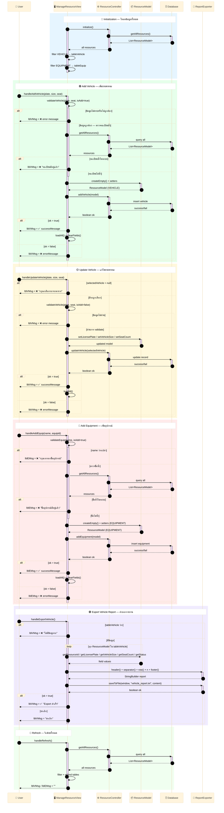

```mermaid
%%{init: {'theme': 'base', 'themeVariables': {'textColor': '#000000', 'labelTextColor': '#000000', 'loopTextColor': '#000000', 'noteBkgColor': '#ffffff', 'noteTextColor': '#000000', 'activationBorderColor': '#000000', 'sequenceNumberColor': '#000000'}}}%%
sequenceDiagram
    autonumber
    participant U as 👤 User
    participant V as 🖥️ ManageResourceView
    participant C as ⚙️ ResourceController
    participant M as 📦 ResourceModel
    participant DB as 🗄️ Database
    participant EX as 📄 ReportExporter

    rect rgb(230, 245, 255)
        note over V,DB: 🔷 Initialization — โหลดข้อมูลทั้งหมด
        V->>C: initialize()
        activate V
        activate C
        C->>DB: getAllResources()
        activate DB
        DB-->>C: List<ResourceModel>
        deactivate DB
        C-->>V: all resources
        deactivate C
        V->>V: filter VEHICLE → tableVehicle
        V->>V: filter EQUIPMENT → tableEquip
        deactivate V
    end

    rect rgb(230, 255, 235)
        note over U,DB: 🟢 Add Vehicle — เพิ่มยานพาหนะ
        U->>V: handleAddVehicle(plate, size, seat)
        activate V
        V->>V: validateVehicle(plate, seat, isAdd=true)
        activate V

        alt ข้อมูลไม่ครบหรือไม่ถูกต้อง
            V-->>U: lblVMsg = ❌ error message
        else ข้อมูลถูกต้อง — ตรวจทะเบียนซ้ำ
            V->>C: getAllResources()
            activate C
            C->>DB: query all
            activate DB
            DB-->>C: List<ResourceModel>
            deactivate DB
            C-->>V: resources
            deactivate C

            alt ทะเบียนซ้ำในระบบ
                V-->>U: lblVMsg = ❌ "ทะเบียนมีอยู่แล้ว"
            else ทะเบียนไม่ซ้ำ
                deactivate V
                V->>M: createEmpty() + setters
                activate M
                M-->>V: ResourceModel (VEHICLE)
                deactivate M
                V->>C: addVehicle(model)
                activate C
                C->>DB: insert vehicle
                activate DB
                DB-->>C: success/fail
                deactivate DB
                C-->>V: boolean ok
                deactivate C

                alt ok = true
                    V-->>U: lblVMsg = ✅ successMessage
                    V->>V: loadAll() + clearFields()
                else ok = false
                    V-->>U: lblVMsg = ❌ errorMessage
                end
            end
        end
        deactivate V
    end

    rect rgb(255, 248, 220)
        note over U,DB: 🟡 Update Vehicle — แก้ไขยานพาหนะ
        U->>V: handleUpdateVehicle(plate, size, seat)
        activate V

        alt selectedVehicle = null
            V-->>U: lblVMsg = ❌ "กรุณาเลือกรถจากตาราง"
        else มีรถถูกเลือก
            V->>V: validateVehicle(plate, seat, isAdd=false)

            alt ข้อมูลไม่ผ่าน
                V-->>U: lblVMsg = ❌ error message
            else ผ่านการ validate
                V->>M: setLicensePlate / setVehicleSize / setSeatCount
                activate M
                M-->>V: updated model
                deactivate M
                V->>C: updateVehicle(selectedVehicle)
                activate C
                C->>DB: update record
                activate DB
                DB-->>C: success/fail
                deactivate DB
                C-->>V: boolean ok
                deactivate C

                alt ok = true
                    V-->>U: lblVMsg = ✅ successMessage
                    V->>V: loadAll()
                else ok = false
                    V-->>U: lblVMsg = ❌ errorMessage
                end
            end
        end
        deactivate V
    end

    rect rgb(255, 235, 235)
        note over U,DB: 🔴 Add Equipment — เพิ่มอุปกรณ์
        U->>V: handleAddEquip(name, equipId)
        activate V
        V->>V: validateEquip(name, isAdd=true)
        activate V

        alt name ว่างเปล่า
            V-->>U: lblEMsg = ❌ "กรุณากรอกชื่ออุปกรณ์"
        else ตรวจชื่อซ้ำ
            V->>C: getAllResources()
            activate C
            C->>DB: query all
            activate DB
            DB-->>C: List<ResourceModel>
            deactivate DB
            C-->>V: resources
            deactivate C

            alt ชื่อซ้ำในระบบ
                V-->>U: lblEMsg = ❌ "ชื่ออุปกรณ์มีอยู่แล้ว"
            else ชื่อไม่ซ้ำ
                deactivate V
                V->>M: createEmpty() + setters (EQUIPMENT)
                activate M
                M-->>V: ResourceModel (EQUIPMENT)
                deactivate M
                V->>C: addEquipment(model)
                activate C
                C->>DB: insert equipment
                activate DB
                DB-->>C: success/fail
                deactivate DB
                C-->>V: boolean ok
                deactivate C

                alt ok = true
                    V-->>U: lblEMsg = ✅ successMessage
                    V->>V: loadAll() + clearFields()
                else ok = false
                    V-->>U: lblEMsg = ❌ errorMessage
                end
            end
        end
        deactivate V
    end

    rect rgb(240, 235, 255)
        note over U,EX: 🟣 Export Vehicle Report — ส่งออกรายงาน
        U->>V: handleExportVehicle()
        activate V

        alt tableVehicle ว่าง
            V-->>U: lblVMsg = ❌ "ไม่มีข้อมูลรถ"
        else มีข้อมูล
            loop ทุก ResourceModel ใน tableVehicle
                V->>M: getResourceId / getLicensePlate / getVehicleSize / getSeatCount / getStatus
                M-->>V: field values
            end
            V->>EX: header() + separator() + row() × n + footer()
            activate EX
            EX-->>V: StringBuilder report
            deactivate EX
            V->>EX: saveToFile(window, "vehicle_report.txt", content)
            activate EX
            EX-->>V: boolean ok
            deactivate EX

            alt ok = true
                V-->>U: lblVMsg = ✅ "Export สำเร็จ"
            else ยกเลิก
                V-->>U: lblVMsg = "ยกเลิก"
            end
        end
        deactivate V
    end

    rect rgb(240, 255, 240)
        note over U,V: 🔄 Refresh — รีเฟรชทั้งหมด
        U->>V: handleRefresh()
        activate V
        V->>C: getAllResources()
        activate C
        C->>DB: query all
        activate DB
        DB-->>C: List<ResourceModel>
        deactivate DB
        C-->>V: all resources
        deactivate C
        V->>V: filter + rebind tables
        V-->>U: lblVMsg / lblEMsg = ""
        deactivate V
    end
```