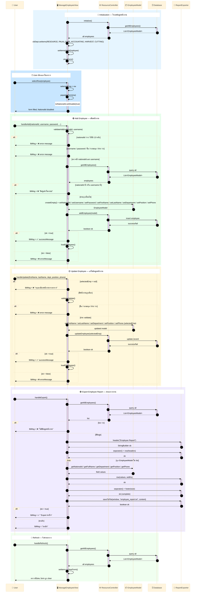

```mermaid
%%{init: {'theme': 'base', 'themeVariables': {'textColor': '#000000', 'labelTextColor': '#000000', 'loopTextColor': '#000000', 'noteBkgColor': '#ffffff', 'noteTextColor': '#000000', 'activationBorderColor': '#000000', 'sequenceNumberColor': '#000000'}}}%%
sequenceDiagram
    autonumber
    participant U as 👤 User
    participant V as 🖥️ ManageEmployeeView
    participant C as ⚙️ ResourceController
    participant M as 📦 EmployeeModel
    participant DB as 🗄️ Database
    participant EX as 📄 ReportExporter

    rect rgb(230, 245, 255)
        note over V,DB: 🔷 Initialization — โหลดข้อมูลพนักงาน
        V->>C: initialize()
        activate V
        activate C
        C->>DB: getAllEmployees()
        activate DB
        DB-->>C: List<EmployeeModel>
        deactivate DB
        C-->>V: all employees
        deactivate C
        V->>V: cbDept.setItems(RESOURCE, PALM_CARE, ACCOUNTING, HARVEST, CUTTING)
        V->>V: setItems(tableEmployee)
        V->>V: clearForm()
        deactivate V
    end

    rect rgb(200, 230, 255)
        note over U,V: 🖱️ User เลือกแถวในตาราง
        U->>V: selectRow(employee)
        activate V
        V->>V: selectedEmp = nw
        V->>V: populateForm(nw)
        note over V: txtNationalId.setDisable(true)
        V-->>U: form filled, NationalId disabled
        deactivate V
    end

    rect rgb(230, 255, 235)
        note over U,DB: 🟢 Add Employee — เพิ่มพนักงาน
        U->>V: handleAdd(nationalId, username, password, ...)
        activate V
        V->>V: validateAdd(nationalId, username)
        activate V

        alt nationalId ว่าง / ไม่ใช่ 13 หลัก
            V-->>U: lblMsg = ❌ error message
        else username / password / ชื่อ / นามสกุล / ฝ่าย ว่าง
            V-->>U: lblMsg = ❌ error message
        else ตรวจซ้ำ nationalId และ username
            V->>C: getAllEmployees()
            activate C
            C->>DB: query all
            activate DB
            DB-->>C: List<EmployeeModel>
            deactivate DB
            C-->>V: employees
            deactivate C

            alt nationalId ซ้ำ หรือ username ซ้ำ
                V-->>U: lblMsg = ❌ "มีอยู่แล้วในระบบ"
            else ผ่านทุกเงื่อนไข
                deactivate V
                V->>M: createEmpty() + setNationalId / setUsername / setPassword / setFirstName / setLastName / setDepartment / setPosition / setPhone
                activate M
                M-->>V: EmployeeModel
                deactivate M
                V->>C: addEmployee(model)
                activate C
                C->>DB: insert employee
                activate DB
                DB-->>C: success/fail
                deactivate DB
                C-->>V: boolean ok
                deactivate C

                alt ok = true
                    V-->>U: lblMsg = ✅ successMessage
                    V->>V: loadEmployees()
                else ok = false
                    V-->>U: lblMsg = ❌ errorMessage
                end
            end
        end
        deactivate V
    end

    rect rgb(255, 248, 220)
        note over U,DB: 🟡 Update Employee — แก้ไขข้อมูลพนักงาน
        U->>V: handleUpdate(firstName, lastName, dept, position, phone)
        activate V

        alt selectedEmp = null
            V-->>U: lblMsg = ❌ "กรุณาเลือกพนักงานจากตาราง"
        else มีพนักงานถูกเลือก
            V->>V: validateUpdate()

            alt ชื่อ / นามสกุล / ฝ่าย ว่าง
                V-->>U: lblMsg = ❌ error message
            else ผ่าน validate
                V->>M: setFirstName / setLastName / setDepartment / setPosition / setPhone (selectedEmp)
                activate M
                M-->>V: updated model
                deactivate M
                V->>C: updateEmployee(selectedEmp)
                activate C
                C->>DB: update record
                activate DB
                DB-->>C: success/fail
                deactivate DB
                C-->>V: boolean ok
                deactivate C

                alt ok = true
                    V-->>U: lblMsg = ✅ successMessage
                    V->>V: loadEmployees()
                else ok = false
                    V-->>U: lblMsg = ❌ errorMessage
                end
            end
        end
        deactivate V
    end

    rect rgb(240, 235, 255)
        note over U,EX: 🟣 Export Employee Report — ส่งออกรายงาน
        U->>V: handleExport()
        activate V
        V->>C: getAllEmployees()
        activate C
        C->>DB: query all
        activate DB
        DB-->>C: List<EmployeeModel>
        deactivate DB
        C-->>V: list
        deactivate C

        alt list ว่าง
            V-->>U: lblMsg = ❌ "ไม่มีข้อมูลพนักงาน"
        else มีข้อมูล
            V->>EX: header("Employee Report")
            activate EX
            EX-->>V: StringBuilder sb
            deactivate EX
            V->>EX: separator() + row(headers)
            activate EX
            EX-->>V: sb
            deactivate EX

            loop ทุก EmployeeModel ใน list
                V->>M: getNationalId / getFullName / getDepartment / getPosition / getPhone
                M-->>V: field values
                V->>EX: row(values, widths)
                activate EX
                EX-->>V: sb
                deactivate EX
            end

            V->>EX: separator() + footer(size)
            activate EX
            EX-->>V: sb (complete)
            deactivate EX
            V->>EX: saveToFile(window, "employee_report.txt", content)
            activate EX
            EX-->>V: boolean ok
            deactivate EX

            alt ok = true
                V-->>U: lblMsg = ✅ "Export สำเร็จ"
            else ยกเลิก
                V-->>U: lblMsg = "ยกเลิก"
            end
        end
        deactivate V
    end

    rect rgb(240, 255, 240)
        note over U,V: 🔄 Refresh — รีเฟรชตาราง
        U->>V: handleRefresh()
        activate V
        V->>C: getAllEmployees()
        activate C
        C->>DB: query all
        activate DB
        DB-->>C: List<EmployeeModel>
        deactivate DB
        C-->>V: all employees
        deactivate C
        V->>V: setItems + clearForm()
        V-->>U: ตารางอัปเดต, form ถูก clear
        deactivate V
    end
```