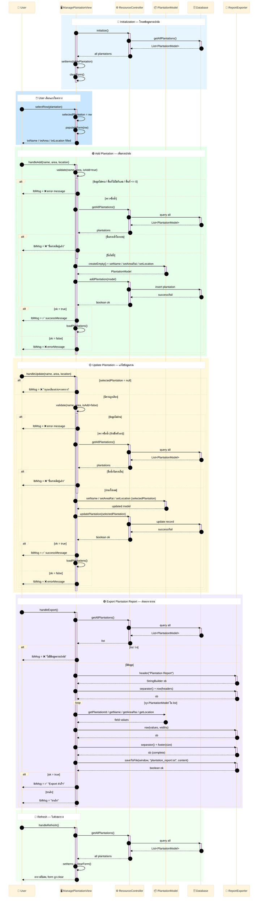

```mermaid
%%{init: {'theme': 'base', 'themeVariables': {'textColor': '#000000', 'labelTextColor': '#000000', 'loopTextColor': '#000000', 'noteBkgColor': '#ffffff', 'noteTextColor': '#000000', 'activationBorderColor': '#000000', 'sequenceNumberColor': '#000000'}}}%%
sequenceDiagram
    autonumber
    participant U as 👤 User
    participant V as 🖥️ ManagePlantationView
    participant C as ⚙️ ResourceController
    participant M as 📦 PlantationModel
    participant DB as 🗄️ Database
    participant EX as 📄 ReportExporter

    rect rgb(230, 245, 255)
        note over V,DB: 🔷 Initialization — โหลดข้อมูลสวนปาล์ม
        V->>C: initialize()
        activate V
        activate C
        C->>DB: getAllPlantations()
        activate DB
        DB-->>C: List<PlantationModel>
        deactivate DB
        C-->>V: all plantations
        deactivate C
        V->>V: setItems(tablePlantation)
        V->>V: clearForm()
        deactivate V
    end

    rect rgb(200, 230, 255)
        note over U,V: 🖱️ User เลือกแถวในตาราง
        U->>V: selectRow(plantation)
        activate V
        V->>V: selectedPlantation = nw
        V->>V: populateForm(nw)
        V-->>U: txtName / txtArea / txtLocation filled
        deactivate V
    end

    rect rgb(230, 255, 235)
        note over U,DB: 🟢 Add Plantation — เพิ่มสวนปาล์ม
        U->>V: handleAdd(name, area, location)
        activate V
        V->>V: validate(name, area, isAdd=true)
        activate V

        alt ข้อมูลไม่ครบ / พื้นที่ไม่ใช่ตัวเลข / พื้นที่ <= 0
            V-->>U: lblMsg = ❌ error message
        else ตรวจชื่อซ้ำ
            V->>C: getAllPlantations()
            activate C
            C->>DB: query all
            activate DB
            DB-->>C: List<PlantationModel>
            deactivate DB
            C-->>V: plantations
            deactivate C

            alt ชื่อสวนซ้ำในระบบ
                V-->>U: lblMsg = ❌ "ชื่อสวนมีอยู่แล้ว"
            else ชื่อไม่ซ้ำ
                deactivate V
                V->>M: createEmpty() + setName / setAreaRai / setLocation
                activate M
                M-->>V: PlantationModel
                deactivate M
                V->>C: addPlantation(model)
                activate C
                C->>DB: insert plantation
                activate DB
                DB-->>C: success/fail
                deactivate DB
                C-->>V: boolean ok
                deactivate C

                alt ok = true
                    V-->>U: lblMsg = ✅ successMessage
                    V->>V: loadPlantations()
                else ok = false
                    V-->>U: lblMsg = ❌ errorMessage
                end
            end
        end
        deactivate V
    end

    rect rgb(255, 248, 220)
        note over U,DB: 🟡 Update Plantation — แก้ไขข้อมูลสวน
        U->>V: handleUpdate(name, area, location)
        activate V

        alt selectedPlantation = null
            V-->>U: lblMsg = ❌ "กรุณาเลือกสวนจากตาราง"
        else มีสวนถูกเลือก
            V->>V: validate(name, area, isAdd=false)
            activate V

            alt ข้อมูลไม่ผ่าน
                V-->>U: lblMsg = ❌ error message
            else ตรวจชื่อซ้ำ (ข้ามชื่อตัวเอง)
                V->>C: getAllPlantations()
                activate C
                C->>DB: query all
                activate DB
                DB-->>C: List<PlantationModel>
                deactivate DB
                C-->>V: plantations
                deactivate C

                alt ชื่อซ้ำกับสวนอื่น
                    V-->>U: lblMsg = ❌ "ชื่อสวนมีอยู่แล้ว"
                else ผ่านทั้งหมด
                    deactivate V
                    V->>M: setName / setAreaRai / setLocation (selectedPlantation)
                    activate M
                    M-->>V: updated model
                    deactivate M
                    V->>C: updatePlantation(selectedPlantation)
                    activate C
                    C->>DB: update record
                    activate DB
                    DB-->>C: success/fail
                    deactivate DB
                    C-->>V: boolean ok
                    deactivate C

                    alt ok = true
                        V-->>U: lblMsg = ✅ successMessage
                        V->>V: loadPlantations()
                    else ok = false
                        V-->>U: lblMsg = ❌ errorMessage
                    end
                end
            end
        end
        deactivate V
    end

    rect rgb(240, 235, 255)
        note over U,EX: 🟣 Export Plantation Report — ส่งออกรายงาน
        U->>V: handleExport()
        activate V
        V->>C: getAllPlantations()
        activate C
        C->>DB: query all
        activate DB
        DB-->>C: List<PlantationModel>
        deactivate DB
        C-->>V: list
        deactivate C

        alt list ว่าง
            V-->>U: lblMsg = ❌ "ไม่มีข้อมูลสวนปาล์ม"
        else มีข้อมูล
            V->>EX: header("Plantation Report")
            activate EX
            EX-->>V: StringBuilder sb
            deactivate EX
            V->>EX: separator() + row(headers)
            activate EX
            EX-->>V: sb
            deactivate EX

            loop ทุก PlantationModel ใน list
                V->>M: getPlantationId / getName / getAreaRai / getLocation
                M-->>V: field values
                V->>EX: row(values, widths)
                activate EX
                EX-->>V: sb
                deactivate EX
            end

            V->>EX: separator() + footer(size)
            activate EX
            EX-->>V: sb (complete)
            deactivate EX
            V->>EX: saveToFile(window, "plantation_report.txt", content)
            activate EX
            EX-->>V: boolean ok
            deactivate EX

            alt ok = true
                V-->>U: lblMsg = ✅ "Export สำเร็จ"
            else ยกเลิก
                V-->>U: lblMsg = "ยกเลิก"
            end
        end
        deactivate V
    end

    rect rgb(240, 255, 240)
        note over U,V: 🔄 Refresh — รีเฟรชตาราง
        U->>V: handleRefresh()
        activate V
        V->>C: getAllPlantations()
        activate C
        C->>DB: query all
        activate DB
        DB-->>C: List<PlantationModel>
        deactivate DB
        C-->>V: all plantations
        deactivate C
        V->>V: setItems + clearForm()
        V-->>U: ตารางอัปเดต, form ถูก clear
        deactivate V
    end
```